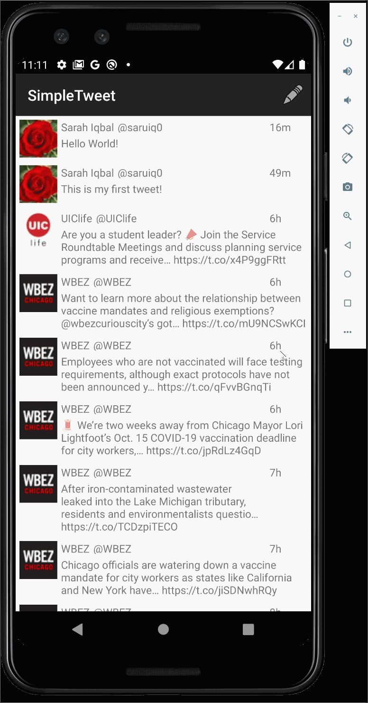

# Project 2 - SimpleTweet

SimpleTweet is an android app that allows a user to view his Twitter timeline and post a new tweet. The app utilizes [Twitter REST API](https://dev.twitter.com/rest/public).

Time spent: 20 hours spent in total

## Part 2

## User Stories

The following **required** functionality is completed:

- [x] User can **compose and post a new tweet**
  - [x] User can click a “Compose” icon in the Action Bar on the top right
  - [x] User can then enter a new tweet and post this to twitter
  - [x] User is taken back to home timeline with **new tweet visible** in timeline
  - [x] Newly created tweet should be manually inserted into the timeline and not rely on a full refresh
  - [x] User can **see a counter with total number of characters left for tweet** on compose tweet page

The following **optional** features are implemented:

- [ ] User is using **"Twitter branded" colors and styles**
- [ ] User can click links in tweets launch the web browser 
- [ ] User can **select "reply" from detail view to respond to a tweet**
- [ ] The "Compose" action is moved to a FloatingActionButton instead of on the AppBar
- [ ] Compose tweet functionality is build using modal overlay
- [x] Use Parcelable instead of Serializable using the popular [Parceler library](http://guides.codepath.org/android/Using-Parceler).
- [ ] User can **open the twitter app offline and see last loaded tweets**. Persisted in SQLite tweets are refreshed on every application launch. While "live data" is displayed when app can get it from Twitter API, it is also saved for use in offline mode.
- [ ] When a user leaves the compose view without publishing and there is existing text, prompt to save or delete the draft. If saved, the draft should then be **persisted to disk** and can later be resumed from the compose view.
- [ ] Enable your app to receive implicit intents from other apps. When a link is shared from a web browser, it should pre-fill the text and title of the web page when composing a tweet. 

The following **additional** features are implemented:

- [ ] List anything else that you can get done to improve the app functionality!

## Video Walkthrough

Here's a walkthrough of implemented user stories:

GIF created with [LiceCap](http://www.cockos.com/licecap/).

## Notes

Describe any challenges encountered while building the app.

Some challenges I face with this project is alongside the usual issue of Android Studio being glitchy and slow, I had some coding issues where when I ran the program, I wasn't getting certain Toast notifications, but I realized that I forgot to add them. Also, in the beginning of the project, I had an issue where I was trying to make the hardcoded text into a string value reference, but although I was following the correct steps, I couldn't get rid of the warning error. However, after asking a TA on slack to confim this issue, the TA said that it was fine that the warning error was there, as long as the program worked! Overall, I didn't have too many concerning issues for this project and I sucessfully finished the app!

## Open-source libraries used

- [Android Async HTTP](https://github.com/codepath/CPAsyncHttpClient) - Simple asynchronous HTTP requests with JSON parsing
- [Glide](https://github.com/bumptech/glide) - Image loading and caching library for Android

## License

    Copyright [yyyy] [name of copyright owner]

    Licensed under the Apache License, Version 2.0 (the "License");
    you may not use this file except in compliance with the License.
    You may obtain a copy of the License at

        http://www.apache.org/licenses/LICENSE-2.0

    Unless required by applicable law or agreed to in writing, software
    distributed under the License is distributed on an "AS IS" BASIS,
    WITHOUT WARRANTIES OR CONDITIONS OF ANY KIND, either express or implied.
    See the License for the specific language governing permissions and
    limitations under the License.

## Part 1

## User Stories

The following **required** functionality is completed:

- [x] User can **sign in to Twitter** using OAuth login
- [x]	User can **view tweets from their home timeline**
  - [x] User is displayed the username, name, and body for each tweet
  - [x] User is displayed the [relative timestamp](https://gist.github.com/nesquena/f786232f5ef72f6e10a7) for each tweet "8m", "7h"
- [x] User can refresh tweets timeline by pulling down to refresh

The following **optional** features are implemented:

- [x] User can view more tweets as they scroll with infinite pagination
- [ ] Improve the user interface and theme the app to feel "twitter branded"
- [ ] Links in tweets are clickable and will launch the web browser
- [ ] User can tap a tweet to display a "detailed" view of that tweet
- [ ] User can see embedded image media within the tweet detail view
- [ ] User can watch embedded video within the tweet
- [ ] User can open the twitter app offline and see last loaded tweets
- [ ] On the Twitter timeline, leverage the CoordinatorLayout to apply scrolling behavior that hides / shows the toolbar.

The following **additional** features are implemented:

- [ ] List anything else that you can get done to improve the app functionality!

## Video Walkthrough

Here's a walkthrough of implemented user stories:

GIF created with [LiceCap](http://www.cockos.com/licecap/).

## Notes

Describe any challenges encountered while building the app.

Some challenges that I faced with this project is when I was trying to open the RestClientTemplate onto Android Studio, I got an error that would recognized certain methods and I was able to run my emulator. After going to the TA, I realized that I was trying to import the file, when I should have just opened the file. I also had an issue when I was inplementing the timestamp for each tweet, I was following the concept guide provided and I was having a hard time writing the function in Tweet.java to grab the time form the API, but I got help from the slack channel and my tech fellows as well! In general, I still faced issues of my Ardroid Studio program being super slow and glitchy but I was able to finall finish the app!

## Open-source libraries used

- [Android Async HTTP](https://github.com/codepath/CPAsyncHttpClient) - Simple asynchronous HTTP requests with JSON parsing
- [Glide](https://github.com/bumptech/glide) - Image loading and caching library for Android

## License

    Copyright [yyyy] [name of copyright owner]

    Licensed under the Apache License, Version 2.0 (the "License");
    you may not use this file except in compliance with the License.
    You may obtain a copy of the License at

        http://www.apache.org/licenses/LICENSE-2.0

    Unless required by applicable law or agreed to in writing, software
    distributed under the License is distributed on an "AS IS" BASIS,
    WITHOUT WARRANTIES OR CONDITIONS OF ANY KIND, either express or implied.
    See the License for the specific language governing permissions and
    limitations under the License.
